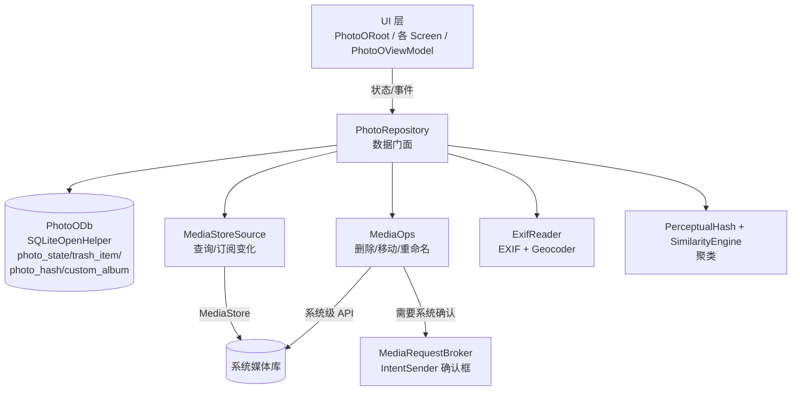

# PhotoO — 本地优先的 Android 图片管理

> 适用 **Android 16 / 17（API 36）** 与 **小米澎湃 OS 3** 的本地图片管理应用。
> 包名 `com.abel.photoo`，应用名 **PhotoO**。
> 设计目标：把系统相册、回收站、相册整理、EXIF 时间线、相似照片聚类，
> 全部收进一个**简洁、跟随系统深浅色、贴合 MIUX 风格**的本地应用里。

PhotoO **不上传任何照片**，所有聚类与反地理编码都在设备本地完成
（反编码无网络时自动降级为只显示经纬度）。

---

## 功能一览

| 模块 | 能力 |
| --- | --- |
| **系统相册** | 通过 `MediaStore` 读取小米系统相册；单张 / 批量选择、预览大图 |
| **大图查看器** | 左右滑切换照片；**上滑移入回收站**；下滑退出；单击显隐工具栏；双击 / 双指缩放 |
| **回收站** | 上滑删除的照片先进入 PhotoO 回收站（在应用内隐藏）；在回收站里**再次删除**才同步给系统删除；可一键还原 |
| **相册整理** | 点击照片「归入相册」；新建相册、重命名相册、删除空相册 |
| **EXIF** | 解析拍摄时间线、拍摄地址（GPS 反地理编码）、拍摄设备（品牌 / 型号 / 镜头）与参数（光圈 / 快门 / ISO / 焦距） |
| **相似照片** | dHash + aHash 双哈希 + 均色校验，自动聚成相似组；提供比对界面，可按策略批量决定「保留 / 删除」 |
| **处理进度** | 记录每张照片是否已筛选 / 归类（`reviewed` 标志）；设置「启动进入未处理照片筛选界面」即可断点续整 |

---

## 架构

单一 `PhotoOViewModel`（`AndroidViewModel`）持有全应用共享状态；导航用单一
`PhotoORoot` 状态机（底部四个 Tab + 覆盖层）实现，而非 Jetpack Navigation 组件，
以减少样板、便于深浅色与覆盖层手势统一管理。



**为什么手写数据层**：工程特意**不使用 Room / KSP**，改用 `SQLiteOpenHelper` +
手写 DAO。原因是 Room 2.x 与 KSP / Kotlin 2.3 在 AGP 8.13（compileSdk 36）下存在
版本耦合风险；本工程锁定的依赖矩阵（见下文）可保证一次解析成功，不依赖注解处理器。

---

## 技术栈与版本矩阵

> 该组合已逐个核对各 AAR 元数据中的 `minCompileSdk` / `minAndroidGradlePluginVersion`，
> 保证在 `compileSdk = 36` + `AGP 8.13.2` 下可解析。

| 项 | 版本 |
| --- | --- |
| Android Gradle Plugin | 8.13.2 |
| Kotlin | 2.3.21 |
| Gradle（wrapper 内置） | 8.14.5 |
| compileSdk / targetSdk | 36 |
| minSdk | 30（Android 11） |
| Jetpack Compose BOM | 2026.06.01（ui 1.11.4 / material3 1.4.0） |
| core-ktx | 1.17.0 |
| lifecycle | 2.10.0 |
| activity-compose | 1.13.0 |
| material-icons-core / extended | 1.7.8（已停更，固定） |
| exifinterface | 1.4.2 |
| Coil（图片加载） | 3.5.0 |
| kotlinx-coroutines | 1.11.0 |

### 升级前必读（重要）

- `androidx.core:core-ktx` **1.18.0+** 要求 `compileSdk 37` + `AGP 9.1`
- `androidx.lifecycle` **2.11.0+** 要求 `compileSdk 37` + `AGP 9.1`
- `material-icons-*` 已停更，固定在 `1.7.8`
- 若要升到 `compileSdk 37`（Android 17），需同时升级 **AGP 到 9.2.x**，
  并按 AGP 9 的 `newDsl` / `builtInKotlin` 行为改造构建脚本（`app/build.gradle.kts`、
  `libs.versions.toml` 中已有注释标注）

---

## 权限说明

| 权限 | 用途 | 备注 |
| --- | --- | --- |
| `READ_MEDIA_IMAGES` | 读取图片（Android 13+） | 必需 |
| `READ_MEDIA_VISUAL_USER_SELECTED` | 「仅选中照片」部分授权（Android 14+） | 已做兼容：用户只授权部分照片时正常降级 |
| `READ_EXTERNAL_STORAGE` | Android 12 及以下回退 | `maxSdkVersion=32` |
| `ACCESS_MEDIA_LOCATION` | 读取原图 EXIF 中的 GPS | 可选；无此权限时地址字段不可用 |
| `MANAGE_MEDIA` | 媒体管理（删除 / 移入回收站 / 重命名免确认） | 可选；授予后删除等操作不再每次弹系统确认框 |
| `INTERNET` | 反地理编码查询地址 | 可选；无网络时自动降级为只显示经纬度 |

---

## 相似照片是怎么找的

1. **感知哈希**：对每张图计算 `dHash`（9×8 梯度哈希）+ `aHash`（8×8 均值哈希）+ 整图均色。
2. **两层预筛**（把候选对从 O(n²) 压到极小规模，两万张图也能在手机上秒级跑完）：
   - **LSH 分桶**：64 位 dHash 切成 4 段 16 位，任意一段完全相同即为候选；
   - **时间邻近**：10 秒连拍窗口内的照片互为候选。
3. **并查集聚类**：对候选对校验 `dHash 汉明距离 ≤ 阈值` 且 `aHash 距离 ≤ 阈值+4`
   且 `均色距离 ≤ 110`，通过则用路径压缩并查集连成组。
4. **联动**：聚类随「删除 / 归档」操作实时重算；组的关键字由成员 id 稳定生成，
   成员变化即视为新组、旧决策自动失效。

相似度档位（汉明距离阈值）：`严格=4` / `均衡=8` / `宽松=12`。
自动保留策略：`最高分辨率` / `最大文件` / `最新拍摄` / `最早拍摄` / `手动选择`。

---

## 构建与运行

### 要求

- **Android SDK**：已安装 `android-36` 平台
- **JDK 17**
- **Gradle 8.14.5**：工程 `gradle/wrapper/` 已内置，无需手动安装
- **Kotlin 2.3.21** / **AGP 8.13.2**：由版本目录统一管理

### 步骤

```bash
# 用 Android Studio 打开本工程根目录（含 settings.gradle.kts）即可；
# 或纯命令行：

# 调试包
./gradlew assembleDebug        # Linux / macOS
gradlew.bat assembleDebug      # Windows

# 安装到已连接设备 / 模拟器
./gradlew installDebug
```

> 释放包默认开启 `minifyEnabled` + `shrinkResources`；如需关闭，改 `app/build.gradle.kts`
> 中 `buildTypes.release`。

---

## 目录结构

```
PhotoO/
├── app/
│   ├── build.gradle.kts
│   ├── proguard-rules.pro
│   └── src/main/
│       ├── AndroidManifest.xml
│       ├── java/com/abel/photoo/
│       │   ├── MainActivity.kt
│       │   ├── PhotoOApp.kt
│       │   ├── model/Models.kt
│       │   ├── data/
│       │   │   ├── PhotoRepository.kt
│       │   │   ├── db/PhotoODb.kt
│       │   │   ├── media/{MediaStoreSource,MediaOps,MediaRequestBroker}.kt
│       │   │   ├── exif/ExifReader.kt
│       │   │   ├── similar/{PerceptualHash,SimilarityEngine}.kt
│       │   │   └── prefs/AppPrefs.kt
│       │   └── ui/
│       │       ├── PhotoORoot.kt
│       │       ├── PhotoOViewModel.kt
│       │       ├── theme/{Theme,Color,Type}.kt
│       │       ├── components/{PhotoGrid,Dialogs,ZoomableImage}.kt
│       │       ├── screens/{Timeline,Albums,AlbumDetail,Review,Similar,Trash,Viewer,Settings}Screen.kt
│       │       └── util/Format.kt
│       └── res/{values,values-night,xml,drawable,mipmap-anydpi-v26}/
├── gradle/{libs.versions.toml,wrapper/}
├── build.gradle.kts
├── settings.gradle.kts
├── gradle.properties
└── .gitignore
```

---

## 设置项速查

| 设置 | 默认值 | 说明 |
| --- | --- | --- |
| 主题模式 | 跟随系统 | `SYSTEM` / `LIGHT` / `DARK` |
| 动态取色（Material You） | 开 | 澎湃 OS 上跟随壁纸 |
| 时间线分组 | 按日 | 按日 / 按月 / 按年 |
| 网格列数 | 4（2–6） | 时间线 / 相册网格密度 |
| 相似保留策略 | 最高分辨率 | 见上文策略列表 |
| 相似度档位 | 均衡（8） | 严格 / 均衡 / 宽松 |
| 上滑同时移入系统回收站 | 关 | 开则上滑即同步系统删除 |
| 启动进入未处理筛选 | 关 | 开则启动直达整理界面续整 |
| 显示拍摄地点 | 开 | 关则 EXIF 面板不显示位置 |

---

## 状态与已知限制

- **本工程源码未经本地编译验证**（构建环境无 Android SDK）。请在 Android Studio 中打开
  `PhotoO/` 目录执行一次 `assembleDebug` 确认；若遇依赖解析问题，先核对上文版本矩阵。
- 相似聚类为**本地启发式**算法，极端场景（如大量纯色截图）已做分桶截断保护，
  但仍可能存在漏聚 / 误聚，建议结合「手动选择」策略复核。
- `MANAGE_MEDIA` 为可选权限；未授予时，系统级删除 / 移动会弹出原生确认框，
  通过 `MediaRequestBroker` 桥接 `IntentSender` 处理。

---

## License

MIT（示例代码，可自由用于学习与二次开发）。
